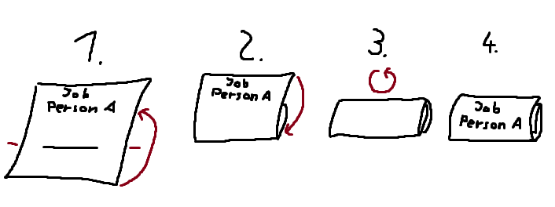

# Murder generator

Generates a list of jobs for the game [murder](http://www.games-wiki.org/wiki/Assassin_game/). Uses `pdflatex` to generate a pdf for the job cutouts.
You can find an example of generated jobs in [`example.pdf`](./example.pdf).

## Requirements

You need to have `pdflatex` installed and `python 3.7+`. To install all the required packages, you can execute `pip install -r requirements.txt`.

## Usage

Put participants in `participants.txt` (like in [`participants-template.txt`](./participants-template.txt)), then `python src/gen_jobs.py`.
You can then find all the jobs in `jobs_pdf/jobs.pdf`.

## Printing

You should print the jobs double sided.
This way, the result is a bunch of little cards.
You can fold the cards twice using the horizontal line as illustrated below, so that the distributers of the jobs don't know their content.



If you only want to print the cards and you do not want to sent the jobs via email, then you can ignore `mail_config-template`, `mails-template.csv`, and `all_jobs_list/`.

## Automatic Job Mails

You can also automatically send emails with `python src/send_mails.py`. But for this you have to do a couple of things:

- create `mail_config.json`
- create `mails.csv`
- fill `all_jobs_list/` with the generated job pdfs

### Mail Config

The mail config `mail_config.json` should contain the following fields:

- `smtp_host`: the smtp server you want to send the mails with
- `smtp_version`: the encryption protocol you want to use with the smtp server (possible values: `ssl`, `tls`)
- `smtp_port`: the port you want to use on the smtp server
- `sender_mail`: the mail address the emails are sent from
- `password`: the password for the mail account
- `language`: the language of the sent message (possible values: `english`, `german`)

#### Gmail Example

This is not supported by gmail anymore, but still a useful example for you to understand how to fill the mail config.

```json
{
    "smtp_host": "smtp.gmail.com",
    "smtp_version": "SSL",
    "smtp_port": 465,
    "sender_mail": "person.omega@gmail.com",
    "password": "super_secret_password",
    "language": "english"
}
```

#### Friedrich-Schiller-Universität Jena Example

This is a working template for students of the Friedrich-Schiller-Universität Jena.

```json
{
    "smtp_host": "smtp.uni-jena.de",
    "smtp_version": "TLS",
    "smtp_port": 587,
    "sender_mail": "firstname.lastname@uni-jena.de",
    "password": "<your password>",
    "language": "german"
}
```

### Mails CSV

Put the participants with their respective emails into `mails.csv`.
Note that the names used in `mails.csv` have to match up exactly with the names used in `participants.csv`.
You will get reminded if this is not the case.

### Job Lists

Put the generated job pdfs (found in `jobs/jobs.pdf`) into `all_jobs_list/` and rename them.
Their filename will be used as the name of the group each file represents.

#### Example

If this is the file structure:

```text
all_job_lists
 ┣ .gitignore
 ┣ Main_Group.pdf
 ┣ Subgroup_A.pdf
 ┗ Subgroup_B.pdf
```

where all of the participants can be found in `Main_Group.pdf`, half of them in `Subgroup_A.pdf`, and the other hald in `Subgroup_B.pdf`, then a valid email could look like this:

```text
Hello Person H,

here are your jobs for the murder game:

group 'Subgroup_A': Person F
group 'Main_Group': Person D

Sincerely, the organisation team of the murder game
```
